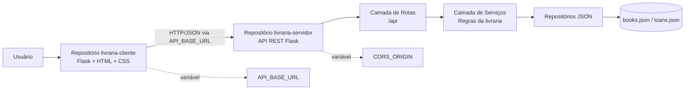

# Arquitetura Cliente-Servidor

```mermaid
flowchart LR
    U[Usuário] --> C[Repositório livraria-cliente<br/>Flask + HTML + CSS]
    C -->|HTTP/JSON via API_BASE_URL| S[Repositório livraria-servidor<br/>API REST Flask]
    S --> R[Camada de Rotas<br/>/api]
    R --> B[Camada de Serviços<br/>Regras da livraria]
    B --> P[Repositórios JSON]
    P --> D[(books.json / loans.json)]

    C -. variável .-> E[API_BASE_URL]
    S -. variável .-> O[CORS_ORIGIN]
```
