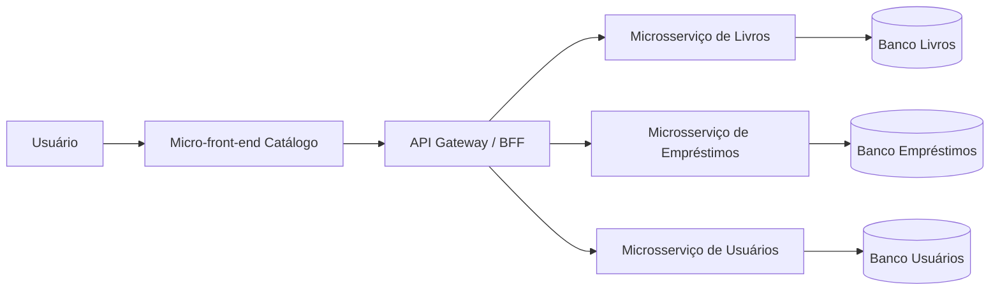

# Possível arquitetura de microsserviços

```mermaid
flowchart LR
    U[Usuário] --> MF[Micro-front-end Catálogo]
    MF --> GW[API Gateway / BFF]
    GW --> MS1[Microsserviço de Livros]
    GW --> MS2[Microsserviço de Empréstimos]
    GW --> MS3[Microsserviço de Usuários]
    MS1 --> DB1[(Banco Livros)]
    MS2 --> DB2[(Banco Empréstimos)]
    MS3 --> DB3[(Banco Usuários)]
```
